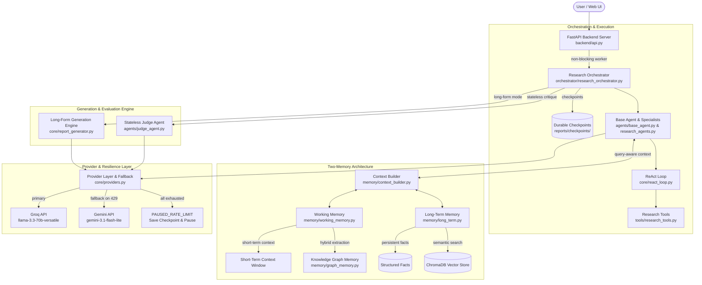

# Noesis : Autonomous Multi-Agent Research System 

An academic-grade Multi-Agent System built in Python, designed to perform end-to-end scientific research, symbolic mathematical derivations, numerical simulations, and technical report writing. The end goal is not to make another chat-bot but a research system focused purely to produce academic grade responses. [This is a personal project, i am learning about memory management and token budgeting to optimize the whole system, scalability is not focused here as of yet.]

Powered by **Groq High-Throughput Llama-3.3-70B / Llama-3.1-8B-Instant** with **Google Gemini fallback (`gemini-3.1-flash-lite`)**, **Two-Memory Architecture (GraphRAG Knowledge Graph + ChromaDB Vector Memory)**, **Centralized Budget & Resilience Layer**, and an **8-Phase ReAct Research Orchestrator**.

---

## System Architecture Diagram



---

## Memory Architecture (Working Memory + Long-Term Memory)

MAS implements a decoupled **Two-Memory Architecture** coordinated by `ContextBuilder` (`memory/context_builder.py`):

### 1. Working Memory (`memory/working_memory.py`)
- **Short-Term Context Window (`memory/short_term.py`)**: Maintains sliding conversation turn windows.
- **Knowledge Graph Memory (`memory/graph_memory.py`)**: Powered by a **NetworkX MultiDiGraph** engine. 
  - **Entity Schemas**: Classifies nodes into `CONCEPT`, `EQUATION`, `METHOD`, `VARIABLE`, `METRIC`, `PERSON`, `ORGANIZATION`.
  - **Alias Resolution**: Maps synonymous terms (`2DEG`, `two-dimensional electron gas`) to canonical node IDs to prevent node duplication.
  - **Hybrid Extraction**: Always-on zero-cost regex extraction combined with selective, budget-bounded LLM extraction.
  - **GraphRAG k-Hop Subgraph Retrieval**: Retrieves 1-hop and 2-hop neighborhoods centered around the active research query and formats them directly into agent prompts.

### 2. Long-Term Memory (`memory/long_term.py`)
- **Local ChromaDB Vector Store**: Persists academic paper chunks and research notes locally with zero LLM embedding API cost.
- **Structured Facts Store**: Retains immutable facts and verified mathematical constants.

---

## Centralized Budget & API Resilience Architecture

To prevent API cost overrun, token rate limit spikes, and retry storms, MAS enforces a centralized execution and budget control system:

### 1. Centralized LLM Budget Manager (`core/budget_manager.py`)
- Thread-safe budget tracking across every research run:
  - `max_llm_calls`, `calls_used`, `input_tokens_used`, `output_tokens_used`, `retry_calls`, `fallback_calls`, `kg_extraction_calls`, `react_calls`.
- **Configurable Profiles & Hard Safety Ceiling**:
  - `QUICK`: Max 15 LLM calls.
  - `STANDARD`: Max 30 LLM calls.
  - `DEEP`: Max 40 LLM calls.
  - `MAX_ABSOLUTE_LLM_CALLS = 45`: Absolute safety ceiling that can never be exceeded.
- **Phase & Generation Protection**: Reserves call/token allocations for report generation, synthesis, and judge evaluation so early ReAct loops cannot deplete the generation budget.

### 2. Bounded Execution Limits
- **ReAct Turn Cap**: Enforces `max_react_steps = 3` per tool-using turn (`core/react_loop.py`).
- **KG LLM Extraction Cap**: Caps LLM Knowledge Graph extractions at 4 calls per run (`memory/graph_memory.py`).

### 3. Memory Pollution Prevention Invariant
- Provider 429 rate limits, HTTP exceptions, transport errors, and timeout strings are strictly blocked from entering Working Memory, Knowledge Graph, or ChromaDB.

---

## The 8-Phase Research Pipeline

The `ResearchOrchestrator` (`orchestrator/research_orchestrator.py`) drives specialist agents through a structured, checkpointed workflow:

```text
[1. UNDERSTAND] ──► [2. LITERATURE] ──► [3. MATHEMATICS] ──► [4. COMPUTATION]
                                                                  │
[8. REPORT]     ◄── [7. SYNTHESIZE] ◄── [6. PEER REVIEW] ◄── [5. ENGINEERING]
```

- **Phase 1 — UNDERSTAND**: Research Planner decomposes prompt into 3-5 technical sub-problems.
- **Phase 2 — LITERATURE**: `LiteratureScout` queries arXiv, Wikipedia, and literature tools.
- **Phase 3 — MATHEMATICS**: `Mathematician` derives governing equations in LaTeX via `SymPyTool`.
- **Phase 4 — COMPUTATION**: `NumericalAnalyst` evaluates equations numerically via SciPy/NumPy.
- **Phase 5 — ENGINEERING**: `Engineer` validates physical bounds and dimensional units.
- **Phase 6 — PEER REVIEW**: `PeerReviewer` performs journal referee critique.
- **Phase 7 — SYNTHESIZE**: `Synthesizer` consolidates shared graph memory into a unified summary.
- **Phase 8 — REPORT**: `LongFormGenerator` produces final document in the requested mode.

---

## Generalized Long-Form Generation Engine (`core/report_generator.py`)

The generation engine supports 5 flexible document modes:
- **`answer`**: Direct single answer.
- **`paragraph`**: Single high-density paragraph.
- **`explanation`**: Multi-paragraph technical explanation.
- **`long_form`**: Sequential chunked response with compact continuation state.
- **`research_paper`**: Academic paper with Abstract, Introduction, Theory, Results, Discussion, and References.

---

## Project Structure

```text
MAS/
├── backend/
│   └── api.py               # FastAPI Backend (REST & SSE Real-Time Streaming)
├── frontend/
│   ├── index.html           # Minimal Workstation Web Interface
│   ├── styles.css           # Monochrome Dark Workstation Theme
│   └── app.js               # SSE Event Router & Toggle State
├── core/
│   ├── budget_manager.py    # Centralized LLM Budget Manager
│   ├── providers.py         # Provider Layer & Universal Fallback Router
│   ├── model_router.py      # Smart Model Complexity Router
│   ├── report_generator.py # Generalized Long-Form Generation Engine
│   └── react_loop.py        # ReAct Reasoning Engine (Bounded Turns)
├── agents/
│   ├── base_agent.py        # Base Agent Class with Memory & Validation Gates
│   ├── research_agents.py   # Specialist Agent Factories
│   └── judge_agent.py       # Stateless Referee Judge Agent
├── memory/
│   ├── context_builder.py   # Dynamic Query-Aware Context Constructor
│   ├── working_memory.py    # Unified Working Memory Wrapper
│   ├── graph_memory.py      # NetworkX Knowledge Graph Memory (GraphRAG)
│   ├── short_term.py        # Context Sliding Window
│   └── long_term.py         # ChromaDB Local Vector Store & Persistent Facts
├── tools/
│   ├── builtin_tools.py     # Calculator & Web Search
│   ├── research_skills.py   # Academic Skills Toolkit
│   └── research_tools.py    # SymPy, SciPy, Unit Converter, arXiv, Wikipedia
├── orchestrator/
│   └── research_orchestrator.py # 8-Phase Research Pipeline Controller
├── reports/                 # Markdown Output Reports & Durable Checkpoints
├── config.py                # Global Settings & Failover Utilities
├── inspect_run.py           # CLI Telemetry & Budget Inspection Script
├── research.py              # Interactive Terminal CLI Application
└── requirements.txt         # Dependencies
```

---

## Getting Started

### 1. Installation
```bash
git clone https://github.com/vihaaaaan17/Multiagent-research-pipeline.git
cd Multiagent-research-pipeline
pip install -r requirements.txt
```

### 2. Configure Environment
Create a `.env` file in the root workspace directory:
```env
GROQ_API_KEY="your_groq_api_key_here"
GEMINI_API_KEY="your_google_gemini_api_key_here"
```

### 3. Running the Server & Inspection
Launch the web interface:
```bash
python -m uvicorn backend.api:app --reload --port 8000
```
Open `http://localhost:8000` in your browser.

Inspect live run telemetry and budget state:
```bash
python inspect_run.py
```

---

## License

Distributed under the MIT License.
